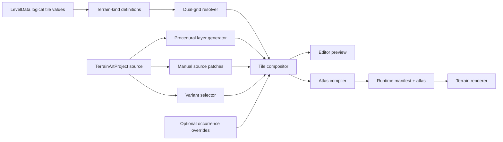

# Dual-Grid Terrain Authoring — Complete Product and Implementation Plan

> **Status:** Proposed implementation plan.
> **Date:** 2026-07-31
> **Scope:** An optional, embedded platformer level editor that starts with a
> complete procedural dual-grid tileset, supports semantic terrain painting,
> lets authors non-destructively edit the generated art, saves those edits, and
> compiles the result into assets that can ship with a game.
> **Primary modules:** `src/level/`, `src/editor/`, `src/terrain/`, a new
> `src/terrain-art/`, and an optional `src/editor-ui/` reference surface.
> **Related decisions:** `editor-core-decision.md`,
> `level-schema-decision.md`, `level-visuals-persistence-decision.md`, and
> `level-visual-rendering-plan.md`.

## 1. Executive summary

The engine should let an author open a game, switch into Edit mode, select a
terrain such as Grass, Rock, Metal, or Water, and paint the shape of a level
without choosing individual corner and edge sprites. A dual-grid resolver turns
the logical cells into the correct visual masks. Every material initially has a
complete procedural tileset controlled by settings such as roundness, contour
width, palette, shading, and detail density, so a usable result exists before the
author draws any art.

The generated result is only the starting point. An author can inspect any
visible part of the level, jump directly to the source tile, and paint into
non-destructive art layers. Those changes normally apply to every use of that
material/mask/variant. A separate, deliberately secondary command can create a
local occurrence override when a genuinely unique landmark is required. All
manual changes can be hidden, reordered, reset by layer, or reverted to the
procedural source.

The workflow is:

1. Paint gameplay meaning and terrain material into the logical level grid.
2. Resolve the visual dual grid automatically.
3. Generate a complete default tileset for every material.
4. Apply stable, seeded visual variants.
5. Inspect the level and edit a reusable source tile when refinement is needed.
6. Use local overrides only for exceptional locations.
7. Save the level and terrain-art source documents.
8. Compile the terrain art into a runtime atlas and manifest.
9. Test immediately in the same canvas.
10. Ship the baked art with or without the editor UI.

The target authoring ratio is approximately:

- **90%:** painting level shapes, materials, entities, and hazards;
- **9%:** adjusting material-wide generator and layer settings;
- **1%:** manually refining source tiles or exceptional occurrences.

If authors routinely need to repair individual corners, the feature has failed.
Manual painting personalizes an already complete system; it does not finish an
incomplete autotiler.

## 2. Why this workflow is credible

The proposed product combines several established editor patterns:

| Proven pattern | Existing example | Use in this engine |
|---|---|---|
| Paint semantic values and derive art from rules | LDtk IntGrid and Auto-Layers | Logical terrain grid remains authoritative; visual layers are derived |
| Paint terrain instead of selecting corner sprites | Tiled Terrain Brush | Material brush drives the dual-grid resolver |
| Automatically connect terrain with manual exceptions | Godot Terrain Connect, Path, and tile overrides | Automatic mask selection plus explicit source/occurrence editing |
| Weighted visual alternatives | Tiled tile probability and Godot random scattering | Stable coordinate-and-seed-based variants |
| Immediate edit/test loop | Super Mario Maker Course Maker | The level remains visible in Edit mode and Play switches simulation, not visibility |

LDtk is the closest architectural precedent: integer values are authored as the
meaning of a cell, and Auto-Layer rules skin those values. Tiled and Godot prove
that neighbor-aware terrain painting is substantially faster than selecting
individual transitions. Mario Maker proves the value of testing without leaving
the construction environment.

The distinctive feature here is the combination of those workflows with a
complete procedural art source that can be edited at pixel level and shipped.
Most existing editors assume the tileset already exists outside the editor.

References:

- <https://ldtk.io/docs/general/auto-layers/>
- <https://ldtk.io/about/>
- <https://ldtk.io/showcase/>
- <https://doc.mapeditor.org/en/stable/manual/terrain/>
- <https://docs.godotengine.org/en/stable/tutorials/2d/using_tilemaps.html#handling-tile-connections-automatically-using-terrains>
- <https://supermariomaker.nintendo.com/play/>

## 3. Product thesis

The author should think in four levels of abstraction, in this order:

1. **Gameplay:** Is this cell empty, solid, passthrough, hazardous, or liquid?
2. **Material:** Is the terrain grass, rock, metal, water, ice, or something else?
3. **Style:** How does that material generate its fill, contour, shading, and
   decoration?
4. **Exception:** Does one reusable tile or one occurrence require manual art?

The UI must preserve that hierarchy. Mask numbers, atlas coordinates, layer
patches, and variant hashes are implementation details. They should appear only
when an author enters the art-inspection workflow.

The core rule is:

> The level stores meaning. The terrain-art asset stores appearance. The dual
> grid derives the connection between them.

This separation gives the engine several benefits:

- collision does not depend on a particular sprite;
- changing art never changes the playable level;
- one material edit can update every level that uses it;
- old levels can adopt a new art set without migration;
- generated levels and hand-authored levels use the same renderer;
- the runtime can ship a compact baked atlas without shipping authoring state;
- the editor can be included for UGC games or tree-shaken from a conventional
  release.

## 4. Goals

### 4.1 Author goals

1. A first-time author can paint a recognizable platform within one minute.
2. Every material has usable art immediately, with no required sprite import.
3. Painting a continuous shape never requires manually choosing corner tiles.
4. The level is visible as soon as the editor opens; Play is not required to
   populate or reveal the canvas.
5. Clicking a visible feature can identify the exact material, mask, variant,
   layer, and occurrence that produced it.
6. Generator controls remain available after manual painting.
7. Regenerating a material does not destroy manual layers.
8. Manual changes can be cleared at occurrence, tile, layer, material, or whole
   art-set scope.
9. Multiple materials can coexist and transition deterministically.
10. Variants add richness without making a level change between runs.
11. The author can switch between Edit and Play without changing files or pages.
12. Saving and reopening reproduces the same result exactly.
13. Exported art can ship in the game without the editor UI.

### 4.2 Engine goals

1. Keep `LevelData.tiles` as the authoritative row-major logical grid.
2. Preserve current collision, level generation, validation, and replay behavior.
3. Keep deterministic code independent of the DOM and `Math.random`.
4. Keep all public APIs never-throw and tolerant of malformed optional data.
5. Make authoring and runtime paths independently tree-shakeable.
6. Reuse the existing terrain material and renderer infrastructure.
7. Keep render work proportional to visible cells and visible art layers.
8. Make save documents versioned, migratable, canonicalizable, and testable.
9. Provide a headless authoring core and an optional no-dependency reference UI.
10. Allow consumers to replace the UI or renderer without replacing the data
    model.

## 5. Non-goals for the first complete release

- A Photoshop-class raster editor.
- Arbitrary vector illustration or pressure-sensitive brushes.
- WebGL shaders, normal maps, or a general lighting system.
- Automatic high-quality transitions between every possible pair of imported
  materials.
- Isometric, hexagonal, or 3D tilemaps.
- Animated terrain timelines. Static water styling is in scope; animation authoring
  is a later extension.
- Multiplayer collaborative editing or CRDT merge.
- Cloud storage, user accounts, moderation, or a public level marketplace.
- Generative-AI texture creation.
- Converting arbitrary external tilesheets into perfect terrain rules.
- Making local occurrence overrides the normal authoring path.
- Persisting renderer callbacks or browser objects.
- Requiring the editor UI in production bundles.

## 6. Terminology and canonical mental model

### 6.1 Logical cell

A cell in `LevelData.tiles`. It stores a numeric terrain-kind value. The terrain
kind resolves to gameplay behavior and a visual material through project-owned
definitions.

### 6.2 Terrain kind

An author-facing brush choice such as `Grass Ground`, `Rock Wall`, `Metal
Platform`, or `Water`. A terrain kind binds:

- one stable numeric `tileValue` stored in the level;
- one collision role;
- one material id;
- one connectivity group;
- one rendering priority;
- optional authoring tags and icon data.

Distinct materials that share collision behavior use distinct tile values. For
example, Grass and Rock can both be solid without being the same logical value.

### 6.3 Material

A reusable visual definition. It owns generator settings, palette, art layers,
variants, and transition priority. Multiple terrain kinds may refer to one
material when they should share appearance.

### 6.4 Logical grid

The original `cols × rows` grid painted by the author. It drives collision and
gameplay.

### 6.5 Dual grid

The derived `(cols + 1) × (rows + 1)` visual grid. Each dual tile is centered on
one intersection of four logical cells and samples those four cells.

The canonical bit order is:

```text
NW = 1    NE = 2
SW = 8    SE = 4
```

The clockwise order is therefore `NW, NE, SE, SW`, producing mask values `0..15`.
Mask `0` is empty and requires no source art. Masks `1..15` are the complete
15-tile dual-grid set.

### 6.6 Source tile

A reusable visual tile addressed by:

```text
material id + mask + variant id
```

Editing a source tile updates every occurrence with that address.

### 6.7 Occurrence

One resolved dual-grid tile at a specific `(dualX, dualY)` in a level. An
occurrence normally uses its source tile without extra data.

### 6.8 Local override

A sparse manual patch attached to one occurrence. It is an exception mechanism,
not a replacement for source editing.

### 6.9 Procedural layer

A non-destructive layer whose pixels are derived from settings and the mask:
base shape, shading, contour, or decoration.

### 6.10 Manual layer

A sparse raster layer containing explicit paint, replacement, or erase commands.
Changing procedural settings does not alter it.

### 6.11 Variant

One visual alternative for a material/mask pair. Selection is deterministic from
the art seed, level id, coordinates, material, mask, and layer seed offset.

## 7. End-to-end author workflows

### 7.1 First open

1. The game creates or loads `LevelData`.
2. The editor resolves the configured terrain-art set. If none exists, it creates
   a default set with one Solid material and one Passthrough material.
3. The level canvas renders immediately in Edit mode.
4. Logical geometry, dual-grid art, entities, validation overlays, and selection
   overlays are independently toggleable.
5. The initial toolbar selects the Terrain Brush and the default Solid terrain
   kind.
6. A short empty-state hint says: “Paint terrain. Corners connect automatically.”

The user never needs to click Play Room merely to see the authored level. Play
changes input ownership and simulation state; it does not mount, populate, or
unhide the level renderer.

### 7.2 Painting a platform

1. Select `Grass Ground` from the material palette.
2. Draw with Pencil, Line, Rectangle, or Fill.
3. The editor groups the pointer gesture into one transaction.
4. Logical cells receive the terrain kind's numeric tile value.
5. Only affected dual tiles are invalidated: each changed logical cell can affect
   at most four dual coordinates.
6. The resolver recomputes masks and variants for that small dirty region.
7. The canvas redraws the finished connected platform.
8. Collision preview updates from the same logical values.

### 7.3 Adjusting the generated style

1. Select a material in the Material panel.
2. Open its Generator section.
3. Adjust roundness, contour width, contour placement, highlight depth, side
   shade, palette, or detail density.
4. The procedural layers regenerate at the selected authoring resolution.
5. Manual layers remain unchanged and are recomposited on top.
6. All source tiles and every level occurrence update immediately.
7. The change is one undoable generator-settings transaction.

### 7.4 Finding the tile responsible for a visible feature

1. Activate Inspect mode or hold the temporary Inspect modifier.
2. Hover a location in the level.
3. The editor highlights the containing dual tile and outlines the four logical
   cells that generated it.
4. A compact tooltip shows material, mask, variant, dual coordinate, and active
   layer contribution.
5. Clicking pins the selection.
6. All occurrences of the same source tile can be highlighted faintly.
7. `Edit Source Tile` opens the tile painter at the exact material/mask/variant.
8. `Override This Occurrence` is available in an overflow or advanced section.

The normal command is always `Edit Source Tile`. Local override is visually and
hierarchically secondary.

### 7.5 Manually refining a reusable tile

1. Open the source tile from the level or atlas browser.
2. Choose or create a Manual Paint layer.
3. Paint with Pencil, Eraser, Line, Rectangle, Ellipse, Fill, or Selection tools.
4. The editor previews the source tile at 1× and magnified scale, surrounded by
   its four common adjacency contexts.
5. Every affected occurrence updates live in the level preview.
6. Each pointer stroke is one undo entry.
7. `Revert Tile on This Layer` clears only the selected tile's manual patch.
8. `Revert Tile to Procedural` clears its patches across all manual layers after
   confirmation and remains undoable.

### 7.6 Creating a local landmark

1. Inspect and pin an occurrence.
2. Choose `Override This Occurrence`.
3. The editor creates a sparse patch keyed by level id and dual coordinates.
4. The override records the expected material, mask, and variant.
5. If later level painting changes that source address, the override becomes
   stale instead of silently jumping to unrelated geometry.
6. A stale-override badge offers `Rebind`, `Keep Hidden`, or `Delete`.
7. `Revert Local Override` restores the reusable source immediately.

### 7.7 Adding a second material

1. Add a Rock material by duplicating Grass or starting from a preset.
2. Assign it a distinct terrain-kind value and collision role.
3. Adjust Rock's generator, palette, layers, and priority.
4. Paint Rock adjacent to Grass.
5. The renderer fills the combined solid silhouette without gaps.
6. The configured material priority decides which material visually overlays the
   shared boundary.
7. An optional transition rule controls whether the boundary is hard, contoured,
   blended, or decorated.

### 7.8 Adding procedural variation

1. Select a material and open Variants.
2. Add variants such as `clean`, `small-crack`, and `moss-tuft`.
3. Assign weights and eligible masks.
4. Optionally restrict a variant to top-facing, side-facing, or interior masks.
5. The level updates using deterministic coordinate-based selection.
6. Changing the camera, paint order, or frame rate does not change choices.
7. Changing the visual seed deliberately rerolls all unpinned variants.
8. A local `Pin Variant` command freezes one occurrence without creating a pixel
   patch.

### 7.9 Saving, testing, and shipping

1. Save commits the `LevelData`, terrain-art source document, and consumer-owned
   project binding through storage callbacks.
2. Play snapshots the editable level and starts the platformer runtime on a clone.
3. Exiting Play restores editor state and retains authoring changes made before
   Play.
4. Runtime mutations never leak back into the authored level.
5. Export validates both documents, bakes all source tiles into an atlas, writes a
   compact runtime manifest, and reports unused or stale data.
6. A development build can include the editor. A conventional release can import
   only the runtime manifest and atlas. A UGC game can deliberately ship both.

## 8. Editor UX specification

### 8.1 Default layout

```text
┌──────────────────────────────────────────────────────────────────────────┐
│ Edit | Play     Undo Redo     Grid Art Collision     -  100%  +  Fit   │
├──────────────┬─────────────────────────────────────────────┬─────────────┤
│ Tools        │                                             │ Inspector   │
│              │              Level canvas                   │             │
│ Select       │                                             │ Selection   │
│ Terrain      │     logical painting + derived dual art     │ Material    │
│ Erase        │                                             │ Generator   │
│ Inspect      │                                             │ Layers      │
│ Entities     │                                             │ Variants    │
│              │                                             │ Validation  │
├──────────────┴─────────────────────────────────────────────┴─────────────┤
│ Terrain palette: Empty | Grass | Rock | Metal | Water | + Material     │
└──────────────────────────────────────────────────────────────────────────┘
```

Opening `Edit Source Tile` changes the center workspace, not the whole
application:

```text
┌──────────────────────────────────────────────────────────────────────────┐
│ ← Level     Grass / mask 7 / clean     -  800%  +  Fit   Grid  Onion   │
├──────────────┬─────────────────────────────────────────────┬─────────────┤
│ Pixel tools  │   magnified tile      1× preview + seams    │ Layers      │
│ Palette      │                                             │ Properties  │
│ Brush size   │   neighboring-context previews              │ Revert      │
└──────────────┴─────────────────────────────────────────────┴─────────────┘
```

### 8.2 Primary level tools

- Select and marquee.
- Terrain Pencil.
- Terrain Eraser.
- Line.
- Filled Rectangle.
- Outline Rectangle.
- Bucket Fill.
- Material Picker.
- Inspect Visual Tile.
- Entity placement and manipulation through the existing editor core.
- Pan as an explicit gesture, middle button, or Space-drag.

The logical terrain brush changes both material and gameplay meaning because the
selected terrain kind already binds both. A separate advanced command can swap a
material while preserving collision role.

### 8.3 Tile-art tools

- Pencil with integer brush sizes.
- Eraser with `inherit` and explicit transparent modes.
- Eyedropper from active layer or final composite.
- Pixel-perfect line using integer rasterization.
- Filled and outline rectangle.
- Filled and outline ellipse.
- Flood fill limited to the active layer.
- Rectangular select, move, duplicate, delete, flip, and rotate 90 degrees.
- Stamp from selection.
- Horizontal and vertical symmetry.
- Palette-linked or literal-color painting.
- Optional silhouette clipping.
- Optional onion-skin preview of the procedural result beneath the active layer.

Every tool operates on integer authoring pixels. Pointer movement is resampled
through the grid so fast drags do not leave holes. A pointer-down to pointer-up
gesture is one history transaction.

### 8.4 Generator controls

The initial stable set is:

| Control | Meaning |
|---|---|
| Authoring resolution | Pixel dimensions of every source tile |
| Roundness | Radius of convex and concave transitions |
| Contour width | Thickness derived from the same silhouette as fill |
| Contour placement | Inside, centered, or outside |
| Top highlight depth | Width of exposed upper-face highlight |
| Side shade depth | Width of exposed side shading |
| Fill color | Main material color |
| Contour color | Boundary color |
| Highlight color | Top-facing accent |
| Shadow color | Recessed/side color |
| Detail color | Procedural decoration color |
| Detail density | Frequency of cracks, tufts, rivets, and similar marks |
| Detail scale | Size of procedural marks |
| Pixel snapping | Crisp integer rasterization policy |

Controls show numeric fields beside sliders. Double-click resets one control.
`Reset Generator` resets the material's procedural settings but never touches
manual or imported layers.

### 8.5 Layer panel

Every layer row contains:

- visibility;
- lock state;
- name;
- layer type icon;
- drag handle;
- opacity;
- blend mode;
- clip policy;
- reset/clear menu;
- contribution indicator for the currently inspected tile.

Default order from bottom to top:

1. Base Generator.
2. Shading.
3. Contour.
4. Procedural Decoration.
5. Manual Paint.

Layers may be hidden and reordered. Procedural layers cannot be destructively
rasterized by ordinary editing. Reordering a layer into a position where it is
fully obscured is allowed but produces a non-blocking warning.

### 8.6 Variant panel

Each variant displays:

- preview thumbnail;
- stable id and author label;
- relative weight;
- eligible masks;
- optional required exposure such as top/side/interior;
- enabled state;
- seed offset;
- manual-layer indicator;
- usage count in the current level.

The panel includes `Preview All`, `Reroll Seed`, `Normalize Weights`, `Duplicate`,
and `Delete`. Deleting a used variant remaps occurrences deterministically and
warns about pinned occurrences.

### 8.7 Zoom, fit, scrolling, and embedded-page behavior

Unmodified mouse-wheel and two-finger trackpad scrolling must remain available to
the containing page. The level editor does not zoom on ordinary wheel events.

Default zoom controls are explicit:

- `−`;
- current percentage;
- `+`;
- `Fit`;
- optional keyboard shortcuts;
- an opt-in consumer setting for modified-wheel zoom.

`Fit` uses the actual inner viewport measured after borders, padding, and visible
panels. It computes:

```text
scale = min(availableWidth / contentWidth, availableHeight / contentHeight)
```

The result is rounded down to a stable zoom step so floating-point rounding never
creates a one-pixel overflow scrollbar. A `ResizeObserver` recomputes the fit when
the editor or side panels resize. The acceptance test requires both scroll extents
to fit inside the viewport with at least one CSS pixel of safety.

Touch input uses pointer capture only during an active drawing gesture. The editor
does not set page-wide `touch-action: none`. Two-finger scrolling outside and over
an idle canvas continues to move the page.

### 8.8 Edit and Play mode

The canvas, level document, camera, and renderer exist in both modes.

- **Edit:** pointer edits are enabled; simulation is paused; editor overlays are
  available.
- **Play:** authoring gestures are disabled; gameplay input owns the canvas; the
  runtime uses a cloned level snapshot.
- **Exit Play:** runtime state is discarded; the authoring camera is restored; the
  level remains visible.

`Play Room` or `Play From Here` may change spawn and camera for the test session,
but neither button is allowed to initialize or reveal the level renderer.

## 9. Architecture

### 9.1 Data flow



### 9.2 Ownership boundaries

| Concern | Owner |
|---|---|
| Collision and logical geometry | `LevelData` and `src/level/` |
| Level edit transactions | Existing `src/editor/` core |
| Connectivity, visibility, and Canvas2D terrain rendering | Existing `src/terrain/` |
| Procedural tile generation, art layers, variants, patches, compilation | New `src/terrain-art/` |
| Consumer mapping of level/game to art set | Consumer project configuration |
| Optional default UI | New leaf `src/editor-ui/` or reference showcase surface |
| Persistence destination | Consumer-provided adapter with in-memory fallback |
| PNG encoding and download | Host/UI adapter, never deterministic core |

### 9.3 Why terrain art is a sidecar asset

The existing level-visual persistence decision correctly avoids putting a theme
inside `LevelData` before ownership is established. This plan keeps that
decision intact.

`TerrainArtProject` is a versioned, project/game-scoped sidecar asset. It can be
shared by many levels. A consumer-owned binding selects an art-set id and visual
seed for a level, biome, campaign, or game.

This avoids:

- duplicating the same tileset in every level;
- changing collision hashes when only art changes;
- expanding the level migration ladder prematurely;
- forcing one level to own a style that may actually belong to a biome or game;
- serializing render callbacks into level data.

If two independent consumers later require a level file to choose its art set,
the existing revisit criteria should be applied and a versioned level-schema
change proposed separately.

### 9.4 Headless core and optional UI

The feature ships in two layers:

1. **Headless authoring core:** pure data, reducers, generator, compositor,
   compiler, hit testing, and serialization. It has no DOM dependency.
2. **Optional reference UI:** a no-runtime-dependency Canvas/DOM editor mounted
   through an explicit function. Browser APIs are resolved lazily inside mount,
   save, import, and export functions.

A game can:

- use the reference UI during development and exclude it from production;
- skin and ship the reference UI for player-created levels;
- build a custom React/Svelte/DOM UI over the headless core;
- use only compiled runtime terrain assets.

## 10. Proposed source data model

The exact names may change during API review, but the ownership and information
must remain.

```ts
export type TerrainMaterialId = string;
export type TerrainLayerId = string;
export type TerrainVariantId = string;

export type TerrainCollisionRole =
  | 'empty'
  | 'solid'
  | 'passthrough'
  | 'hazard'
  | 'liquid';

export interface TerrainKindDefinition {
  readonly id: string;
  readonly label: string;
  readonly tileValue: number;
  readonly collision: TerrainCollisionRole;
  readonly materialId: TerrainMaterialId | null;
  readonly connectGroup: string;
  readonly renderPriority: number;
  readonly icon?: Readonly<TerrainIconRef>;
  readonly tags?: readonly string[];
}

export interface TerrainArtProject {
  readonly version: number;
  readonly id: string;
  readonly name: string;
  readonly authoringResolution: number;
  readonly visualSeed: number;
  readonly terrainKinds: readonly TerrainKindDefinition[];
  readonly materials: readonly TerrainMaterialDefinition[];
  readonly transitionRules: readonly TerrainTransitionRule[];
  readonly occurrenceOverrides: readonly TerrainOccurrenceOverride[];
}

export interface TerrainMaterialDefinition {
  readonly id: TerrainMaterialId;
  readonly name: string;
  readonly enabled: boolean;
  readonly priority: number;
  readonly palette: Readonly<TerrainArtPalette>;
  readonly generator: Readonly<TerrainGeneratorSettings>;
  readonly layers: readonly TerrainArtLayer[];
  readonly variants: readonly TerrainVariantDefinition[];
}

export interface TerrainGeneratorSettings {
  readonly roundness: number;
  readonly contourWidth: number;
  readonly contourPlacement: 'inside' | 'center' | 'outside';
  readonly topHighlightDepth: number;
  readonly sideShadeDepth: number;
  readonly detailDensity: number;
  readonly detailScale: number;
  readonly antialias: 'none' | 'coverage';
  readonly clipManualToSilhouette: boolean;
}

export type TerrainArtLayer =
  | TerrainBaseLayer
  | TerrainShadingLayer
  | TerrainContourLayer
  | TerrainDecorationLayer
  | TerrainManualLayer
  | TerrainImportedLayer;

export interface TerrainLayerCommon {
  readonly id: TerrainLayerId;
  readonly name: string;
  readonly visible: boolean;
  readonly locked: boolean;
  readonly opacity: number;
  readonly blendMode: TerrainBlendMode;
  readonly clipMode: 'none' | 'material-silhouette' | 'world-silhouette';
}

export interface TerrainManualLayer extends TerrainLayerCommon {
  readonly type: 'manual';
  readonly patches: readonly TerrainSourcePatch[];
}

export interface TerrainVariantDefinition {
  readonly id: TerrainVariantId;
  readonly label: string;
  readonly enabled: boolean;
  readonly weight: number;
  readonly eligibleMasks: readonly number[];
  readonly exposure: 'any' | 'top' | 'side' | 'interior';
  readonly seedOffset: number;
}
```

All ids are stable author-assigned strings. Arrays, not `Map` or `Set`, cross the
serialization boundary. Normalization builds efficient internal lookup tables.

### 10.1 Manual pixel representation

A manual patch must distinguish three states:

1. **Inherit:** this pixel contributes nothing; lower layers remain visible.
2. **Paint:** replace or blend with an RGBA color.
3. **Erase:** explicitly remove composed pixels according to the layer's erase
   semantics.

Transparent RGBA cannot represent both Inherit and Erase, so the source format
uses explicit sparse commands:

```ts
export interface TerrainPixelRun {
  readonly y: number;
  readonly x: number;
  readonly length: number;
  readonly mode: 'paint' | 'erase';
  readonly rgba?: number;
  readonly colorRef?: keyof TerrainArtPalette;
}

export interface TerrainSourcePatch {
  readonly mask: number;
  readonly variantId: TerrainVariantId;
  readonly runs: readonly TerrainPixelRun[];
}
```

Runs are normalized in row-major order and merged when adjacent values are
identical. Empty patches are removed. This remains compact for ordinary pixel
touch-ups, is deterministic, survives JSON, and avoids requiring a PNG decoder in
the authoring core.

Palette-linked paint stores `colorRef`; literal paint stores packed RGBA. Palette
links let later material recoloring propagate through manual detail, while literal
color supports unrestricted authorship.

### 10.2 Occurrence overrides

```ts
export interface TerrainOccurrenceOverride {
  readonly levelId: string;
  readonly dualX: number;
  readonly dualY: number;
  readonly materialId: TerrainMaterialId;
  readonly expectedMask: number;
  readonly expectedVariantId: TerrainVariantId;
  readonly pinnedVariantId?: TerrainVariantId;
  readonly layerPatches: readonly TerrainOccurrenceLayerPatch[];
}
```

The expected source address prevents an override from silently attaching to a
different shape after the level is repainted. Resolution statuses are:

- `active`: source address still matches;
- `stale-mask`: material matches but mask changed;
- `stale-material`: logical material changed;
- `orphaned`: coordinate is outside the current level;
- `missing-variant`: pinned/source variant no longer exists.

Only `active` overrides render automatically. Others remain saved and visible in
the diagnostics panel until the author rebinds or removes them.

## 11. Dual-grid resolution

### 11.1 Coordinate mapping

For dual coordinate `(dx, dy)`, sample logical cells:

```text
NW: (dx - 1, dy - 1)
NE: (dx,     dy - 1)
SE: (dx,     dy)
SW: (dx - 1, dy)
```

Out-of-bounds logical cells are Empty. The visual tile is drawn at:

```text
worldX = dx * tileSize - tileSize / 2
worldY = dy * tileSize - tileSize / 2
```

This makes the visual grid one tile wider and taller than the logical grid and
places each tile around a logical-cell intersection.

### 11.2 Per-material mask

For a material `M`, set each bit when the corresponding logical cell resolves to
`M`. A material absent from all four corners has mask `0` and produces no pass.

The resolver returns a prepared visual address rather than raw pixels:

```ts
export interface ResolvedDualTile {
  readonly dualX: number;
  readonly dualY: number;
  readonly occupancyMask: number;
  readonly materials: readonly ResolvedDualMaterial[];
}

export interface ResolvedDualMaterial {
  readonly materialId: TerrainMaterialId;
  readonly mask: number;
  readonly variantId: TerrainVariantId;
  readonly priority: number;
}
```

`occupancyMask` uses any non-empty terrain kind, independent of material. It
defines the world-versus-empty silhouette. Per-material masks define styling
inside that silhouette.

### 11.3 Dirty-region invalidation

Changing logical cell `(x, y)` invalidates only these dual coordinates:

```text
(x, y), (x + 1, y), (x, y + 1), (x + 1, y + 1)
```

Batch operations union those coordinates in a small integer-keyed set, resolve
once after the transaction, and redraw once. Fill operations may choose a bounding
rectangle path when it is cheaper than sparse invalidation.

### 11.4 Connectivity and material identity

Collision connectivity and visual material identity are related but not
identical:

- `connectGroup` controls whether logical cells form one gameplay/structural mass;
- `materialId` controls which visual source tiles apply;
- `occupancyMask` treats any non-empty collidable terrain as world geometry;
- transition rules control the visible seam between materials.

This allows Grass and Rock to form one gap-free solid platform while remaining
visually distinct.

## 12. Procedural mask generation

### 12.1 One silhouette, all dependent layers

The fill, contour, shading, and clipping masks must derive from the same canonical
coverage field. They must never construct separate rounded paths from nominally
matching parameters.

The generation order is:

1. Build the binary four-corner topology for a mask.
2. Construct a canonical continuous or supersampled coverage field.
3. Enforce connected tile-edge coverage where a mask continues across an edge.
4. Resolve final fill coverage at the authoring resolution.
5. Derive contour through morphological expansion/erosion of that coverage.
6. Derive shading from the same coverage boundary and exposure direction.
7. Clip procedural decoration to the requested silhouette.

This directly prevents the previously observed corner mismatch where fill and
contour appeared to use different radii.

### 12.2 Roundness semantics

`roundness = 0` means mathematically square convex and concave corners. There must
be no residual radius from contour width, stroke joins, antialiasing, or minimum
curve clamps.

At positive values:

- convex and concave transitions use the same radius convention;
- the radius is clamped to a valid fraction of tile resolution;
- connected edges remain fully covered to the tile boundary;
- symmetry-related masks are exact transforms of the same canonical result;
- contour width does not alter the centerline of the silhouette.

The UI may expose normalized `0..1`, but the rasterizer resolves it to authoring
pixels in one documented function.

### 12.3 Contour derivation

Contour is derived from fill coverage, not redrawn as a separate stroked path.

Conceptually:

```text
inside contour  = fill - erode(fill, width)
outside contour = dilate(fill, width) - fill
center contour  = dilate(fill, ceil(width/2)) - erode(fill, floor(width/2))
```

The implementation may use a distance transform or bounded morphological kernel,
but the result must preserve these semantics. The same source makes contour
roundness and fill roundness necessarily agree.

### 12.4 Edge and seam invariants

For any two adjacent visual tiles that represent continuous occupancy:

- their shared edge coverage must coincide;
- there must be no transparent antialias fringe at the shared edge;
- contour must not appear on an internal continuation edge;
- authoring resolution and world tile size may differ without opening a seam;
- symmetry transforms must preserve edge pixels exactly.

The atlas compiler can add a one-pixel extrusion gutter around each tile to
protect Canvas2D scaling from sampling neighboring atlas entries. The gutter is
not part of authoring resolution.

### 12.5 Resolution

Initial supported source resolutions:

- 16×16;
- 32×32;
- 48×48;
- 64×64 default;
- 96×96;
- 128×128.

The public core accepts a bounded integer for future flexibility, but the default
UI exposes tested presets. A hard normalized maximum protects imported documents
from memory abuse.

When resolution changes:

1. Procedural layers regenerate natively at the new resolution.
2. Manual patches are previewed with nearest-neighbor resampling by default.
3. The author confirms or cancels the migration.
4. Confirmation creates one undoable transaction containing old and new patches.
5. Literal one-pixel details may be flagged as changed by a preview overlay.
6. Runtime atlas metadata is invalidated and rebuilt.

Nearest-neighbor is the safe default for pixel art. A later optional resampler can
be added without changing the source contract.

## 13. Non-destructive art layers

### 13.1 Common layer contract

All layers participate in one deterministic compositor. Each layer has stable id,
order, visibility, lock state, opacity, blend mode, and clipping mode.

Initial blend modes:

- `normal`;
- `multiply`;
- `screen`;
- `add`;
- `replace`;
- `erase`.

Unsupported or malformed blend modes normalize to `normal`. Runtime compilation
flattens these modes, so the runtime renderer does not need to reproduce authoring
compositing logic per frame.

### 13.2 Base Generator layer

Creates material fill from the canonical silhouette. It is present by default and
can be hidden but not deleted. Hiding it allows imported/manual art workflows
without discarding generator settings.

### 13.3 Shading layer

Produces top highlights, side shading, recess shading, or simple palette-derived
depth. It reads exposure and the canonical silhouette. It does not change
collision or coverage.

### 13.4 Contour layer

Produces the inner, centered, or outer contour from the same fill field. It owns
contour color and width but not its own independent radius.

### 13.5 Procedural Decoration layer

Produces cracks, grass tufts, stones, rivets, stains, bubbles, or similar marks.
Every mark is addressed by stable seed components. Decoration can be clipped to:

- the material silhouette;
- exposed top surfaces;
- exposed sides;
- interior areas;
- no clip.

### 13.6 Manual Paint layer

Stores sparse source patches. It is unaffected by generator regeneration.
Multiple manual layers allow independent edits such as `Moss`, `Damage`, and
`Highlights`.

### 13.7 Imported layer

References consumer-provided raster content through a serializable asset id and
tile mapping, never a live `Image` object. Asset lookup and image loading remain
host responsibilities. Missing assets produce diagnostics and leave lower layers
visible.

### 13.8 Reset semantics

Reset commands are explicit and scoped:

| Command | Effect |
|---|---|
| Reset property | Restore one procedural property default |
| Reset generator | Restore all generator settings for one material |
| Clear tile on active layer | Remove one source patch from one layer |
| Revert tile to procedural | Remove that source tile's patches from all manual layers |
| Clear manual layer | Remove every patch from one manual layer |
| Reset procedural layer | Restore its settings, seed offset, opacity, and blend defaults |
| Revert material art | Clear all manual source patches for one material |
| Revert occurrence | Remove one local override or pinned variant |
| Revert all local overrides | Remove occurrence-level exceptions only |

Every reset is undoable. Material-wide and project-wide destructive resets require
confirmation with a count of affected tiles and overrides.

## 14. Multiple terrain materials

### 14.1 Authoring model

Each logical cell contains one terrain kind and therefore at most one base
material. Overlay phenomena such as water surface foam or snow are decoration or
future overlay layers, not multiple base values in one logical cell.

Materials have stable priorities. Priority is used only to resolve visual overlap,
not collision.

### 14.2 Gap-free ordered-overlay algorithm

A naive approach renders every material independently against transparency. At a
shared rounded boundary this can create gaps or double contours. The engine uses
an ordered overlay model:

1. Compute the union `occupancyMask` of all non-empty logical corners.
2. Generate the world-versus-empty silhouette once from that union.
3. Collect distinct materials present in the four logical corners.
4. Sort them by stable priority and id.
5. Fill the world silhouette with the lowest-priority present material as the
   support/base pass.
6. Overlay each higher-priority material using its own membership mask.
7. Draw the world contour once around the union silhouette.
8. Draw an inter-material contour only when a transition rule requests one.
9. Clip all passes to the union silhouette unless a layer explicitly allows an
   overhang.

The support pass means curved foreground material can reveal the lower material
instead of the page background. This creates a clean grass-over-dirt or
metal-over-rock transition while keeping empty-world boundaries intact.

### 14.3 Transition rules

```ts
export interface TerrainTransitionRule {
  readonly foregroundMaterialId: TerrainMaterialId;
  readonly backgroundMaterialId: TerrainMaterialId;
  readonly mode: 'hard' | 'contour' | 'soft' | 'decorated';
  readonly width: number;
  readonly colorRef?: keyof TerrainArtPalette;
  readonly decorationLayerId?: TerrainLayerId;
}
```

The default rule is `hard`, derived from priority. `contour` draws one boundary
owned by the foreground. `soft` uses a small bounded coverage blend.
`decorated` allows a transition-specific procedural layer such as grass tufts at
a soil edge.

Rules are directional. Grass-over-Dirt may differ from Dirt-over-Grass. The UI can
offer a `Swap` command and warn about contradictory priority.

### 14.4 Material management

Authors can:

- create from preset;
- duplicate;
- rename;
- reorder priority;
- change bound terrain kind;
- copy/paste generator settings;
- copy selected layers;
- export/import one material;
- locate all uses in current level;
- delete after choosing a replacement material.

Deleting a material never silently converts cells to Empty. The command requires a
replacement terrain kind or is blocked while the material is in use.

### 14.5 Initial material presets

The reference UI should ship a small, restrained preset set built entirely from
procedural layers:

- Grass/soil;
- Rock;
- Metal;
- Ice;
- Water;
- Neutral solid;
- Passthrough platform.

Presets are factories, not a global eager registry, so they remain tree-shakeable.
They are intended as editable starting points rather than final art direction.

## 15. Procedural variants

### 15.1 Deterministic selection

Variant selection uses a stable address:

```text
visualSeed
+ level id
+ material id
+ mask
+ dualX
+ dualY
+ variant-layer seed offset
```

The components are type-tagged and folded through the existing deterministic
visual-seed helpers. Selection does not depend on draw order, viewport, time,
frame rate, or the number of RNG calls made elsewhere.

### 15.2 Weighted selection

Only enabled variants whose mask and exposure filters match are candidates.
Weights are finite non-negative numbers. Invalid weights normalize to zero. If no
candidate has a positive weight, the first enabled base variant is used. If none
exists, a built-in `default` procedural variant is synthesized.

Selection walks candidates in stable id order over a normalized integer range so
equivalent documents select identically across JavaScript engines.

### 15.3 Variant composition

A variant can change:

- procedural decoration seed and density;
- visibility or settings of designated variant-aware layers;
- manual patches for the same mask;
- imported tile mapping;
- optional palette accents.

A variant does not change logical topology, collision, or the mask.

### 15.4 Pinned variants

Pinning stores only a variant id on an occurrence override. It does not copy
pixels. A missing or ineligible pinned variant produces a diagnostic and falls
back deterministically without throwing.

### 15.5 Seed changes

Changing `visualSeed` previews a complete reroll. It is one undoable art-project
operation. Pinned occurrences remain pinned. Manual source tiles remain attached
to their variant ids.

## 16. Direct painting and source-tile editing

### 16.1 Global source editing is the default

The level inspector resolves a clicked pixel into:

```ts
export interface TerrainVisualHit {
  readonly levelId: string;
  readonly worldX: number;
  readonly worldY: number;
  readonly dualX: number;
  readonly dualY: number;
  readonly localPixelX: number;
  readonly localPixelY: number;
  readonly logicalCorners: readonly TerrainLogicalCornerHit[];
  readonly materialContributions: readonly TerrainMaterialContribution[];
  readonly topContribution: TerrainMaterialContribution | null;
}
```

The UI selects the visually topmost non-transparent contribution at the clicked
pixel, not merely the highest-priority material present somewhere in the tile.
This matters at curved transitions where the background material is visible.

The inspector can cycle contributions when several layers overlap.

### 16.2 Context previews

Editing an isolated mask is insufficient for seam work. The tile painter renders:

- the tile by itself over a checkerboard;
- a 3×3 context chosen from representative compatible neighbors;
- all symmetry-related masks;
- at least one world-edge context;
- one material-to-material transition context;
- a live list of occurrences in the current level.

Hovering a context neighbor explains which mask it represents. Clicking an
occurrence pans the level view to it.

### 16.3 Clip behavior

Manual layers default to `material-silhouette`, preventing accidental paint from
opening seams or leaking into empty space. Authors can choose:

- `material-silhouette` for texture/detail;
- `world-silhouette` for art spanning a material boundary but not empty space;
- `none` for overhangs such as grass blades.

The UI clearly marks unclipped layers because they can create cross-tile overlap.
Atlas gutters account for intentional overhang within a documented maximum.

### 16.4 Editing generated output without destroying it

The composed tile shown in the editor is a preview, not the stored bitmap. Paint
goes into the selected Manual layer. Erase can mean:

- erase manual paint back to Inherit;
- explicitly erase lower composed pixels;
- clear a selected region of the active manual layer.

The default eraser is `back to Inherit`, because that restores procedural output
and is the least destructive behavior.

## 17. Art-editor operations and undo

### 17.1 Operations

Art editing uses serializable discriminated operations, including:

```text
setGeneratorProperty
setMaterialPaletteColor
addMaterial
duplicateMaterial
removeMaterial
reorderMaterial
addLayer
updateLayer
reorderLayer
removeLayer
paintPixelRuns
clearSourcePatch
replaceSourcePatch
addVariant
updateVariant
removeVariant
setVisualSeed
addOccurrenceOverride
updateOccurrenceOverride
removeOccurrenceOverride
changeResolution
batch
```

### 17.2 History storage

The existing level editor can continue using level snapshots because `LevelData`
is small. Art history should not snapshot an entire high-resolution art project
for every brush stroke.

Art history entries store compact before/after payloads:

- generator and property edits store old/new values;
- ordering edits store old/new id arrays;
- pixel strokes store normalized before/after runs for the affected region;
- resolution changes store the old/new affected patches as one larger entry;
- material deletion stores the deleted material document and replacement mapping.

The optional UI presents one chronological Undo/Redo command but delegates to the
domain recorded by the last workspace transaction. A workspace history entry is:

```ts
export type TerrainWorkspaceHistoryEntry =
  | { readonly domain: 'level'; readonly transactionId: number }
  | { readonly domain: 'art'; readonly transactionId: number };
```

Level and art domain histories remain independently testable. Undoing one art
stroke never restores an unrelated level snapshot.

### 17.3 Transaction rules

- One pointer stroke is one transaction.
- One slider drag is one transaction committed on pointer release; intermediate
  preview values are not separate history entries.
- One Fill, Flip, Rotate, Clear, or Revert command is one transaction.
- Adding a material preset is one batch transaction.
- Painting logical cells and creating source art are never implicitly combined.
- Entering/exiting Play is not an authoring-history entry.
- Selection, zoom, pan, open panels, and visibility previews are not history.

## 18. Persistence and migrations

### 18.1 Source artifacts

The editable project consists of:

```text
level.json                    Existing LevelData
terrain-art.json              TerrainArtProject source
project binding               Consumer-owned level/art-set/seed association
optional imported images      Consumer asset pipeline
```

The terrain-art document contains procedural settings and sparse manual patches,
not a browser canvas dump.

### 18.2 Runtime artifacts

Export produces:

```text
terrain-art.runtime.json      Compact atlas metadata and material bindings
terrain-art.png               Flattened source tiles with extrusion gutters
```

Optional debugging export also writes a labeled contact sheet. Source JSON is not
required at runtime unless the game ships editing.

### 18.3 Storage adapter

```ts
export interface TerrainAuthoringStorageAdapter {
  readonly loadLevel: (id: string) => Promise<unknown>;
  readonly saveLevel: (level: Readonly<LevelData>) => Promise<void>;
  readonly loadTerrainArt: (id: string) => Promise<unknown>;
  readonly saveTerrainArt: (project: Readonly<TerrainArtProject>) => Promise<void>;
}
```

Public wrappers catch adapter failures and return structured results. The engine
ships an in-memory adapter for tests and demos. Consumers can provide file,
IndexedDB, server, or platform storage.

### 18.4 Versioning

`TerrainArtProject.version` has its own forward migration ladder. Migration:

- never throws;
- preserves unknown optional metadata when safe;
- clamps abusive sizes and counts;
- assigns deterministic ids when old versions lack them using document position,
  never time or randomness;
- returns diagnostics for repaired or discarded data;
- validates after every step;
- has canonical fixture tests for every supported version.

The runtime manifest has a separate compact version because source and runtime
formats evolve for different reasons.

### 18.5 Canonicalization and dirty state

Source documents serialize with stable key order and normalized row-major runs.
The editor computes a deterministic content hash after successful saves. Dirty
state compares the current canonical hash to the saved hash rather than relying
only on UI event flags.

Autosave is optional and adapter-owned. The reference UI debounces autosave but
always offers an explicit Save command and warns before closing with unsaved
changes.

### 18.6 Import safety limits

Normalization applies configurable hard limits to untrusted documents:

- maximum authoring resolution;
- maximum material count;
- maximum layers per material;
- maximum variants per material;
- maximum pixel runs and decoded pixels;
- maximum occurrence overrides;
- finite numeric fields;
- valid mask range `1..15`;
- valid coordinates and run lengths;
- unique ids after repair.

Oversized content produces diagnostics and fails closed without allocating an
unbounded buffer.

## 19. Atlas compilation and runtime rendering

### 19.1 Compiler stages

1. Normalize and validate the source document.
2. Resolve material, layer, transition, and variant lookup tables.
3. Generate canonical coverage for masks `1..15` at authoring resolution.
4. Composite every enabled material/mask/variant source tile.
5. Render transition-specific tiles if the runtime format requires them.
6. Pack tiles into a deterministic atlas layout.
7. Extrude tile-edge pixels into gutters.
8. Produce the runtime manifest.
9. Produce raw pixel data or a canvas for the host encoder.
10. Hash manifest and pixel bytes for cache invalidation.

### 19.2 Deterministic atlas layout

Packing order is stable:

```text
material priority, material id, mask, variant id, transition id
```

The first implementation uses a simple fixed-column grid rather than a
space-optimizing bin packer. Predictability, debuggability, and stable diffs are
more valuable than small packing gains for uniform tile sizes.

### 19.3 Runtime manifest

The runtime manifest maps the visual address to atlas source rectangles and
includes:

- schema version;
- authoring resolution;
- gutter size;
- material priorities;
- terrain-kind tile-value bindings;
- variant definitions and weights;
- transition rules required at draw time;
- atlas dimensions;
- content hash;
- fallback tile location.

The level's coordinates still select variants at runtime. All pixel compositing is
already baked.

### 19.4 Runtime draw path

1. Compute the visible dual-grid range from the world viewport.
2. Resolve or read cached `ResolvedDualTile` entries.
3. Select deterministic variants.
4. Choose atlas entries for each material pass and transition.
5. Draw with `imageSmoothingEnabled = false` for pixel-art modes.
6. Snap source and destination rectangles using existing DPR contracts.
7. Draw occurrence overrides through a small override atlas or prepared patch
   cache only when present.

No authoring-layer traversal occurs in the ordinary baked runtime path.

### 19.5 Export choices

The reference editor provides:

- `Save Source`;
- `Export Runtime Atlas`;
- `Export Contact Sheet`;
- `Validate Project`;
- `Package Level + Art Source` for sharing an editable project.

PNG encoding uses a host canvas and `toBlob` only when the user invokes export.
The headless compiler returns pixel data and manifest objects without touching the
DOM.

## 20. Integration with the existing engine

### 20.1 `src/level/`

No immediate `LevelData` schema change is required.

- Numeric tile values remain stored in `TileGrid.data`.
- `TerrainKindDefinition.tileValue` maps those numbers to material and collision.
- Existing `createTileQuery` can receive a classifier derived from terrain kinds.
- Existing level validation remains authoritative for dimensions and tile-array
  length.
- An optional cross-document validator reports unknown tile values or missing
  material bindings.

### 20.2 `src/editor/`

Reuse:

- `paintTiles` operations;
- snapshot history for level edits;
- transaction grouping;
- undo/redo coordination;
- playtest snapshot/restore;
- validation cache;
- selection and snapping math.

Add only the glue needed to associate a selected terrain kind with the numeric
value passed to `paintTiles`. Art operations belong in `src/terrain-art/`, not in
the existing `LevelData` reducer.

### 20.3 `src/terrain/`

Reuse:

- viewport culling;
- deterministic visual addressing;
- material normalization and palette helpers;
- Canvas state discipline;
- connection tables;
- existing rectangle/tile rendering fallbacks;
- surface and edge detail concepts where they map cleanly.

The new atlas-backed renderer should be additive. Existing procedural terrain
renderers remain available for consumers that do not use authored dual-grid art.

### 20.4 `src/platformer/`

The platformer scene renderer accepts an optional compiled terrain-art renderer.
When absent, it uses the existing material renderer. Editor and Play modes use the
same prepared level geometry and art binding.

### 20.5 Root exports and tree shaking

New modules export leaf factories and pure helpers. There is no eager global list
containing every material preset, tool, or editor panel. Optional UI code performs
no work at module import and is not referenced by runtime-only helpers.

## 21. Proposed file structure

```text
src/terrain-art/
├── types.ts                   Public source/runtime/diagnostic types
├── constants.ts               Versions, limits, defaults
├── factory.ts                 Default art project and material factories
├── normalize.ts               Defensive source normalization
├── validate.ts                Cross-field validation
├── migrate.ts                 Source migration ladder
├── serialize.ts               Canonical serialization and hashing
├── dual-grid.ts               Coordinate and mask resolution
├── dirty-region.ts            Sparse invalidation helpers
├── coverage.ts                Canonical mask coverage generation
├── morphology.ts              Contour derivation
├── procedural-layers.ts       Base, shading, contour, decoration generation
├── layer-compositor.ts        Non-destructive layer composition
├── pixel-runs.ts              Sparse manual patch operations
├── variants.ts                Stable filtering and weighted selection
├── transitions.ts             Ordered material composition
├── hit-test.ts                World-to-source contribution resolution
├── occurrence-overrides.ts    Status, apply, rebind, cleanup
├── operations.ts              Pure art reducer
├── history.ts                 Compact inverse payload history
├── workspace-history.ts       Level/art chronological coordination
├── compile.ts                 Atlas and runtime-manifest compiler
├── runtime-renderer.ts        Visible atlas-backed drawing
├── storage.ts                 Safe adapter wrappers and memory adapter
└── index.ts                   Barrel exports

src/editor-ui/
├── terrain-editor.ts          Explicit mount/unmount entry point
├── terrain-editor-types.ts    Host callbacks and UI configuration
├── input-controller.ts        Pointer/keyboard gesture routing
├── level-canvas.ts            Edit/Play shared canvas integration
├── tile-painter.ts            Pixel editor surface
├── fit-viewport.ts            Zoom/Fit/ResizeObserver behavior
├── material-panel.ts          Material and terrain-kind controls
├── layer-panel.ts             Layer controls
├── variant-panel.ts           Variant controls
├── diagnostics-panel.ts       Validation/stale override UI
└── index.ts                   Side-effect-free leaf export

src/tests/
├── terrain-art-dual-grid.test.ts
├── terrain-art-coverage.test.ts
├── terrain-art-contour.test.ts
├── terrain-art-layers.test.ts
├── terrain-art-pixel-runs.test.ts
├── terrain-art-materials.test.ts
├── terrain-art-transitions.test.ts
├── terrain-art-variants.test.ts
├── terrain-art-hit-test.test.ts
├── terrain-art-overrides.test.ts
├── terrain-art-history.test.ts
├── terrain-art-migrate.test.ts
├── terrain-art-serialize.test.ts
├── terrain-art-compile.test.ts
├── terrain-art-runtime.test.ts
└── terrain-art-barrel.test.ts
```

The exact UI structure may remain in the showcase until the interaction model is
validated. Promotion to `src/editor-ui/` occurs only after the reference surface
has stable host contracts and at least one real consumer.

## 22. Validation and diagnostics

Diagnostics are structured, clickable, and never thrown as ordinary exceptions.
They include:

- unknown logical tile value;
- missing material;
- duplicate terrain-kind value;
- duplicate id;
- material with no base variant;
- invalid or empty variant weight set;
- out-of-range mask;
- invalid pixel run;
- missing imported asset;
- transition referencing a missing material;
- contradictory priority/rule;
- stale or orphaned occurrence override;
- manual patch outside current resolution;
- atlas exceeding configured dimensions;
- unsupported runtime manifest version;
- no fallback tile;
- source/runtime hash mismatch.

Clicking a diagnostic selects its material, layer, source tile, logical cell, or
occurrence when applicable.

Validation levels:

- **Error:** export cannot reproduce a safe result.
- **Warning:** result is safe but likely unintended.
- **Info:** unused, redundant, or optimizable content.

## 23. Performance and memory plan

### 23.1 Prepared caches

Cache keys include only deterministic source inputs:

- coverage: `resolution + mask + roundness + antialias mode`;
- procedural tile: material generator hash + mask + variant + layer visibility;
- composed source tile: material source hash + mask + variant;
- resolved level tile: logical corner values + art binding + coordinates + seed;
- occurrence patch: override content hash.

Changing one layer invalidates only that layer and composites above it. Changing
roundness invalidates silhouette-dependent layers. Changing palette does not
invalidate geometry coverage.

### 23.2 Interactive generation

Slider movement uses preview quality while dragging when full regeneration would
miss the frame budget. Pointer release commits full-quality generation. Work is
chunked or scheduled between frames; stale jobs are cancelled by generation id.

The first implementation remains synchronous for small projects and adds a
worker only after measurement shows it necessary. Pure array inputs keep a future
worker boundary straightforward.

### 23.3 Sparse manual data

Manual source art stores only changed runs. The editor may expand one active tile
to a mutable pixel buffer during a stroke, then normalizes it back to runs on
commit. Inactive source tiles remain compact.

### 23.4 Provisional budgets

Budgets must be finalized from Phase 0 measurements, but the intended targets on
a typical desktop browser are:

- a single-cell paint update should resolve and schedule redraw within one frame;
- a 64×64 source-tile brush stroke should remain visually responsive at 60 Hz;
- regenerating 15 masks for one 64×64 material should feel immediate;
- compiling a moderate set of eight materials and four variants each should not
  block interaction without progress feedback;
- runtime draw cost should be proportional to visible dual tiles, not total level
  size;
- an art project with no manual edits should serialize compactly because it stores
  settings, not generated pixels.

No absolute regression gate is adopted until the benchmark harness records a
repeatable baseline on CI hardware.

## 24. Testing strategy

### 24.1 Pure unit tests

1. Every mask `0..15` resolves from known logical corners.
2. Dual-grid dimensions are exactly `(cols + 1) × (rows + 1)`.
3. Out-of-bounds samples are Empty.
4. One logical edit invalidates exactly its four surrounding dual tiles.
5. Symmetry transforms map masks and pixels correctly.
6. `roundness = 0` has square convex and concave corners.
7. Contour is derived from fill and contains no radius mismatch.
8. Continuous shared edges have identical coverage.
9. Pixel runs normalize, merge, clip, paint, erase, and round-trip.
10. Layer visibility, order, opacity, blend, and clipping are deterministic.
11. Palette-linked manual pixels update with palette changes.
12. Variants remain stable across draw order and viewport changes.
13. Zero/invalid weights fall back safely.
14. Material ordering is stable under equal priorities through id tie-break.
15. Multi-material union silhouettes contain no background holes.
16. Transition ownership produces one requested contour, not two.
17. Hit testing returns the visually topmost non-transparent contribution.
18. Stale occurrence overrides do not render.
19. Revert commands affect only their documented scope.
20. Art undo/redo round-trips exact canonical source.
21. Migrations never throw and produce valid normalized documents.
22. Atlas layout is byte-stable for equivalent canonical documents.
23. Runtime and source paths choose the same variants.
24. Public barrel exports are reachable without importing the UI.

### 24.2 Exhaustive topology tests

For a small set of Empty plus four materials, enumerate all `5^4 = 625` corner
combinations. Assert:

- union occupancy is correct;
- every present material receives the correct membership mask;
- sort order is deterministic;
- composed coverage never escapes the union silhouette;
- no occupied pixel becomes unintended page background;
- world contour appears only at union boundaries.

### 24.3 Property tests

Generate seeded random logical grids and assert:

- full resolution equals incremental dirty-region resolution;
- saving/loading preserves canonical hash;
- undoing all operations restores the original hash;
- camera culling does not change selected variants;
- repainting the same value is a no-op;
- material renaming does not alter stable id behavior;
- reordering UI lists without priority changes does not alter rendering.

### 24.4 Visual review artifacts

Automated numeric tests cannot judge all corner aesthetics. Generate labeled
contact sheets for:

- all 15 masks at every resolution preset;
- roundness at 0%, 25%, 50%, 75%, and 100%;
- contour widths and placement modes;
- horizontal, vertical, convex, and concave seam pairs;
- all built-in material presets;
- two-, three-, and four-material intersections;
- variants at several seeds;
- manual paint before/after/revert;
- clipped and unclipped overhangs;
- 1×, fractional DPR, and scaled world-tile rendering.

The reference level includes long platforms, single cells, holes, stairs, narrow
tunnels, checkerboards, concave rooms, material junctions, and screen-edge tiles.

### 24.5 Interaction tests

Browser-level tests verify:

- level visible immediately in Edit mode;
- Play and Exit Play preserve authored data;
- Dual Grid view toggle works on first click;
- page wheel/two-finger scroll does not zoom the editor;
- explicit zoom buttons work;
- Fit produces no horizontal or vertical scrollbar;
- pointer capture ends on cancel/up/outside;
- one stroke creates one undo entry;
- source-tile inspection selects the correct mask;
- highlight-all-usages locates every matching source address;
- resolution change preview can cancel without mutation;
- clearing manual updates restores the live procedural result;
- save/reload produces the same pixels and selected variants.

### 24.6 Runtime tests

- runtime-only import has no DOM side effects;
- missing atlas or manifest falls back safely;
- malformed runtime entries do not throw;
- visible-range culling draws only expected coordinates;
- Canvas state is restored after drawing;
- DPR and camera transforms preserve shared-edge coincidence;
- editor source and compiled runtime screenshots match within the declared raster
  policy.

## 25. Accessibility and usability

- Every icon-only control has a label and tooltip.
- Material identity is communicated by names, icons, and patterns, not color alone.
- Active tool, layer, and mode have text-visible state.
- Keyboard focus does not become trapped in the canvas.
- All toolbar and panel actions are keyboard reachable.
- Shortcuts are disabled while typing in inputs.
- The inspector can present mask names such as `top-left outer corner` beside the
  numeric mask.
- Reduced-motion mode disables animated transition previews and pulsing highlights.
- High-contrast selection overlays remain distinct from terrain palettes.
- Touch targets meet the host application's minimum size.
- Error diagnostics describe recovery actions in plain language.

## 26. Security and robustness

- Do not execute script, expressions, or callbacks stored in imported art JSON.
- Treat asset ids as opaque consumer references, not trusted URLs.
- Validate dimensions before allocating pixel buffers.
- Bound flood-fill work to the active tile buffer.
- Cancel stale asynchronous generation by token.
- Restore Canvas state with balanced save/restore even when consumer callbacks fail.
- Never use `Math.random`, `Date.now`, or global mutable counters for authored
  output.
- Never mutate `LevelData` or `TerrainArtProject` inputs.
- Never let a failed save clear dirty state.
- Do not overwrite a source file during export until the host reports successful
  completion.
- Provide an in-memory adapter and procedural fallback for unavailable host APIs.

## 27. Implementation phases

Each phase ends with a visible, testable gate. Later phases must not be used to
excuse broken fundamentals in earlier phases.

### Phase 0 — Lock behavior and preserve the current MVP

**Purpose:** Capture what already works, record current visual output, and prevent
regression while the architecture changes.

Deliverables:

- inventory the existing dual-grid MVP behavior and files;
- record screenshots/contact sheets at every current resolution;
- add focused regression cases for the rounding and contour mismatch examples;
- record current level/tile editor input behavior;
- confirm logical and dual coordinate conventions;
- measure regeneration, drawing, and serialized-size baselines;
- document any MVP behavior deliberately discarded.

Gate:

- a reproducible baseline scene exists;
- roundness zero and current problematic corners have explicit expected results;
- no implementation work begins with ambiguous bit ordering or coordinate origin.

### Phase 1 — Source model, normalization, validation, and serialization

**Purpose:** Establish a durable asset contract before adding UI state.

Deliverables:

- `TerrainArtProject` and related public types;
- default project/material factories;
- stable ids and constants;
- normalization and hard limits;
- validation diagnostics;
- canonical serialization and hashing;
- migration ladder scaffolding;
- in-memory storage adapter;
- barrel and no-side-effect tests.

Gate:

- a default source document round-trips byte-identically after canonicalization;
- malformed fixtures never throw;
- an empty manual-art project is compact and valid.

### Phase 2 — Correct dual-grid coverage and generator

**Purpose:** Replace ad-hoc path/stroke behavior with one mathematically coherent
silhouette used by every layer.

Deliverables:

- canonical mask and coordinate helpers;
- all 15 generated silhouettes;
- roundness semantics with true square zero;
- contour derived from fill coverage;
- shading/exposure inputs;
- resolution presets and regeneration;
- adjacency/seam tests;
- labeled mask contact sheet.

Gate:

- all topology, symmetry, seam, and rounding tests pass;
- the previously reported convex/concave mismatch is absent;
- changing contour width cannot change fill radius.

### Phase 3 — Layer compositor and procedural style controls

**Purpose:** Make generation non-destructive before introducing manual art.

Deliverables:

- base, shading, contour, and decoration layer implementations;
- stable layer ordering, visibility, opacity, blend, and clipping;
- layer-specific invalidation;
- generator panel model;
- reset-property/layer/generator operations;
- initial procedural presets;
- source/composite cache.

Gate:

- hiding, reordering, and resetting any layer does not mutate another layer;
- regeneration yields the same result after save/load;
- the default material is usable without manual edits.

### Phase 4 — Logical painting and visual inspection

**Purpose:** Make level construction fast and make visual provenance obvious.

Deliverables:

- terrain-kind palette bound to numeric tile values;
- Pencil, Erase, Line, Rectangle, Fill, and Picker logical tools;
- four-dual-cell dirty invalidation;
- Inspect mode and contribution-aware hit testing;
- highlight source tile, logical corners, and all matching occurrences;
- source-tile navigation from the level;
- always-visible Edit canvas;
- working Dual Grid/Logical Grid overlays;
- explicit zoom/Fit behavior with page scrolling preserved.

Gate:

- an author can paint a complete room without selecting atlas tiles;
- clicking any visible terrain pixel identifies its source;
- Fit produces no scrollbars;
- unmodified trackpad scroll never zooms the embedded editor;
- Play is not required to see the level.

### Phase 5 — Manual source-tile painting

**Purpose:** Let authors personalize generated art without losing generator
controls.

Deliverables:

- sparse pixel-run representation;
- Manual Paint layers;
- Pencil, Eraser, Eyedropper, Line, Rectangle, Ellipse, Fill, Select/Move,
  Flip/Rotate, and Stamp tools;
- palette-linked and literal colors;
- silhouette clipping and onion skin;
- representative seam/context previews;
- compact art history;
- tile/layer/material revert commands;
- source edits reflected live in all level occurrences.

Gate:

- changing roundness after painting preserves manual art;
- clearing a tile's manual updates restores its current procedural output;
- one brush stroke is one undo step;
- manual painting cannot accidentally modify logical collision.

### Phase 6 — Multiple materials and transitions

**Purpose:** Allow grass, rock, metal, water, and other terrain to coexist without
gaps or ambiguous painting.

Deliverables:

- material and terrain-kind management;
- ordered overlay composition;
- union world silhouette;
- priority editing;
- hard and contour transition rules;
- material replacement on delete;
- exhaustive 625-corner-combination tests;
- transition contact sheets.

Gate:

- adjacent solid materials never reveal unintended page background;
- world contour is not doubled at material boundaries;
- collision stays unchanged when only material styling changes;
- deleting an in-use material cannot silently erase level cells.

### Phase 7 — Deterministic variants and decoration

**Purpose:** Add visual richness without compromising reproducibility.

Deliverables:

- stable variant filtering and weighted selection;
- mask/exposure eligibility;
- variant-aware procedural and manual layers;
- variant panel and usage counts;
- seed reroll;
- pinned occurrence variant;
- deterministic tests across viewport and draw order.

Gate:

- the same source, level, and seed always select the same variants;
- camera movement and repaint order do not reroll art;
- seed changes reroll only unpinned occurrences;
- missing variants fall back without throwing.

### Phase 8 — Occurrence overrides and diagnostics

**Purpose:** Support rare landmarks while protecting authors from overrides that
silently drift after topology changes.

Deliverables:

- occurrence patch model;
- advanced local editing command;
- expected-address validation;
- active/stale/orphaned statuses;
- rebind, hide, and delete recovery actions;
- override usage browser;
- revert one/all local overrides;
- export warnings for stale content.

Gate:

- a topology edit cannot move a local patch to an unrelated source silently;
- source editing remains the visually primary path;
- stale overrides are preserved, diagnosed, and excluded safely.

### Phase 9 — Save, compile, runtime atlas, and embedded editor productization

**Purpose:** Complete the author-to-shippable-game loop.

Deliverables:

- safe storage wrapper and host callbacks;
- source migration fixtures;
- deterministic atlas compiler and gutters;
- runtime manifest and renderer;
- PNG/contact-sheet export adapter;
- source/runtime visual comparison;
- optional reference editor mount/unmount API;
- development-only and UGC shipping examples;
- bundle-size and runtime benchmarks;
- integration and API documentation.

Gate:

- saving/reopening reproduces the same canonical source and rendered result;
- compiled runtime matches editor preview;
- runtime-only import does not pull in editor UI or authoring panels;
- a sample game can edit, save, reload, play, export, and run from baked assets.

## 28. Release slices

The phases can be grouped into three usable releases:

### Release A — Generator-first dual-grid editor

Phases 0–4.

Authors can paint logical terrain, adjust a reliable high-resolution generator,
inspect masks, and play immediately. No manual pixel art yet.

### Release B — Editable procedural tilesets

Phase 5 plus the core of Phase 6.

Authors can add manual layers, use better drawing tools, revert to procedural, and
work with multiple materials.

### Release C — Shippable terrain-art pipeline

Phases 7–9.

Authors gain deterministic variants, safe occurrence overrides, source saves,
runtime compilation, and the optional embedded editor package.

Release B is the first version that fully expresses the product promise. Release
C is the version suitable for a documented public engine capability.

## 29. Acceptance criteria for the complete capability

The feature is complete only when all statements below are true.

### Level authoring

1. A new level is visible immediately in Edit mode.
2. Authors paint terrain kinds, not mask ids.
3. Lines, rectangles, fill, erase, and picker work with one undo per gesture.
4. The dual grid updates incrementally and correctly.
5. Collision preview is derived from the logical grid and never from artwork.

### Generator

6. Every material has complete source art for masks `1..15` without manual input.
7. Roundness zero is square for both convex and concave corners.
8. Fill, contour, shading, and clip masks share one silhouette.
9. All continuous neighbor pairs are seam-free at tested resolutions and DPRs.
10. Resolution can change with preview, cancel, confirm, and undo.

### Manual editing

11. Clicking level art opens the responsible material/mask/variant.
12. Editing a source tile updates all matching occurrences.
13. Manual layers survive any generator change.
14. Manual edits can be hidden, reordered, cleared, or reverted by scope.
15. The default eraser restores Inherit rather than destroying lower output.
16. The tile painter includes the specified core drawing tools and context preview.

### Materials and variants

17. At least four base materials can coexist in one level.
18. Shared material boundaries have deterministic ownership and no unintended gap.
19. Material delete requires a safe replacement when in use.
20. Weighted variants are stable by coordinates and seed.
21. Variant selection is invariant under camera movement and draw order.
22. Pinned variants survive seed changes.

### Overrides

23. Local occurrence editing is available but secondary to source editing.
24. Overrides record their expected source address.
25. Stale overrides do not render silently and have recovery actions.
26. Any local override can revert to its source tile in one undoable action.

### Editor usability

27. Unmodified wheel/two-finger scrolling does not zoom the embedded level editor.
28. Explicit zoom buttons work.
29. Fit removes both editor scrollbars with a safety margin.
30. Edit/Play switching does not mount or unmount the visible level.
31. Tool, layer, material, and mode state are textually identifiable and keyboard
    reachable.

### Persistence and shipping

32. Source save/load is versioned, deterministic, and never-throw.
33. Dirty state follows canonical content rather than UI event guesses.
34. Runtime export emits a deterministic manifest and atlas.
35. Runtime rendering visually matches the editor's compiled preview.
36. Runtime-only consumers do not import the optional editor UI.
37. A sample game can ship baked art while excluding the source and editor.
38. A sample UGC game can deliberately ship the editor and persist user changes.

## 30. Risks and mitigations

### Risk: manual editing becomes required

**Mitigation:** Every material must generate all masks. Ship contact-sheet and seam
gates before pixel editing. Keep source editing a refinement workflow.

### Risk: the UI exposes tile theory instead of level design

**Mitigation:** Default to named terrain kinds and ordinary painting tools. Mask
ids appear only in Inspect and tile-art views, always with human-readable names.

### Risk: generator controls invalidate manual work

**Mitigation:** Store manual changes as independent sparse layers. Regeneration
recomposites; it never overwrites manual runs.

### Risk: multiple materials create gaps or double outlines

**Mitigation:** Use one union world silhouette and ordered material overlays. Draw
world contour once. Exhaustively test all small corner combinations.

### Risk: local overrides accumulate and become mysterious

**Mitigation:** Make them advanced, record expected source address, diagnose stale
entries, show usage counts, and provide bulk cleanup.

### Risk: variants flicker or move

**Mitigation:** Address selection from stable semantic components. Never advance a
shared RNG stream while drawing.

### Risk: high resolution makes editing slow or saves huge

**Mitigation:** Store procedural settings and sparse manual runs, cache composed
tiles, invalidate narrowly, preview during slider drags, and bake only on export.

### Risk: authoring UI bloats runtime bundles

**Mitigation:** Keep UI side-effect-free, optional, and disconnected from runtime
leaf imports. Add a runtime-only bundle smoke test and size budget.

### Risk: sidecar ownership is confusing

**Mitigation:** The reference UI presents Level and Terrain Art as one workspace,
while Save reports each artifact. Consumers normally configure one art set for a
game or biome, not per brush stroke.

### Risk: imported or old data allocates excessive memory

**Mitigation:** Validate bounded dimensions/counts before decoding pixel runs or
creating buffers. Fail closed with diagnostics.

## 31. Decisions fixed by this plan

The following should not be reopened during implementation without a written
decision update:

1. Logical level data is authoritative for gameplay.
2. Terrain art is a versioned sidecar asset for now, not a new `LevelData` field.
3. The visual grid uses the documented four-bit corner order.
4. Source editing is global by default; occurrence editing is exceptional.
5. Manual art is non-destructive and layer-based.
6. Fill and contour derive from one canonical silhouette.
7. Roundness zero is truly square.
8. Variants are deterministic by semantic address.
9. Multiple materials use a union silhouette and ordered overlays.
10. The default editor does not capture unmodified wheel/two-finger page scroll.
11. Fit must account for the real inner viewport and leave no scrollbar.
12. Edit mode displays the level without requiring Play.
13. Runtime export bakes art; runtime drawing does not composite authoring layers
    every frame.
14. The editor UI is optional and tree-shakeable.

## 32. Deferred extensions

Once the complete capability is stable, the architecture can support:

- animated material layers and water surfaces;
- biome-level art-set inheritance;
- overlay materials such as snow, moss, and corruption;
- transition-specific hand-painted tiles;
- rule-based decoration placement beyond one tile;
- slope and one-way platform topology;
- destructible terrain with incremental rebaking;
- imported Aseprite layers and palette tags;
- reusable stamps and room templates;
- prefab terrain structures;
- player-facing share codes containing source art;
- collaborative operation logs;
- mobile-specific authoring layout;
- Web Worker atlas compilation;
- GPU-backed large-map rendering;
- signed/moderated UGC packages;
- art-set inheritance with per-game overrides;
- automatic unused-patch and duplicate-variant cleanup.

These additions must preserve the central model: semantic level data first,
derived visual topology second, non-destructive art refinement third.

## 33. Recommended first implementation task

Begin with Phase 0 and Phase 2's silhouette contract, not with additional UI.
Specifically:

1. Freeze the canonical bit order and dual coordinate mapping in tests.
2. Capture the current 15-mask contact sheet at 64×64.
3. Add regression fixtures for the reported roundness-zero and contour mismatch
   corners.
4. Replace independent fill/stroke construction with one coverage field and
   derived contour.
5. Regenerate the contact sheet at all resolution presets.
6. Accept the result visually before building layer and persistence APIs on top.

Every later capability assumes that the generated source is topologically correct.
A reliable silhouette is therefore the highest-leverage next step.

## 34. Definition of done

This plan is delivered when an engine consumer can start from no terrain images,
mount the optional editor in a platformer, paint a multi-material level, adjust
roundness and contour settings, inspect a visible corner, paint a manual source
layer, add stable cracks or tufts as variants, revert any manual work to the live
procedural result, save and reopen the project, play it immediately, compile its
terrain atlas, and ship the same visual result in a runtime-only build.

The successful experience should feel like painting level intent first and making
art second—not maintaining a tilesheet by hand.
